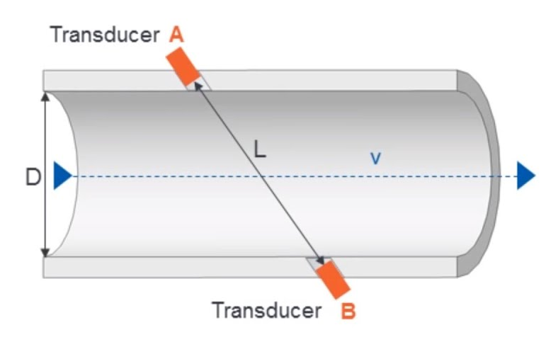

### Theory

An ultrasonic sensor is an instrument that measures the distance to an object using ultrasonic sound waves. As the name implies ultrasonic sensor operates on ultrasonic frequencies. Frequencies beyond our hearing range are known as ultrasonic frequencies. Those frequencies are above 20k Hertz. The transducer of the sensor acts as a microphone to receive and send the ultrasonic sound. Ultrasound travels faster than audible sound. An ultrasonic sensor consists of two main components: a transmitter and a receiver. 

In addition to sending a pulse, a transducer can receive an echo as well. The transmitter of the module transmits an ultrasonic sound. This sound will be reflected if an object(like solids, liquids, granules, and powders) is present in front of the ultrasonic sensor. The reflected sound is received by the receiver present in the same module. The sensor determines the distance to a target by measuring time lapses between the sending and receiving of the ultrasonic pulse. By calculating the travel time and the speed of sound, the distance can be calculated.

Using the room-temperature speed of sound in air, 343 m/s, we can quickly find the distance, keeping in mind that the noise travels in both directions—to and from the target. As a result, we get the following velocity-time equation

	Time = [(Distance * 2) /Speed of Sound] X 1000

An ultrasonic sensor type flow and level sensor is a non-contact sensor that uses ultrasonic waves to measure the level of liquid or solid materials in a container. 

##### Level Sensor
An ultrasonic sensor type level sensor is a device that measures the level of liquid in a tank, well, pit, lake, or other body of liquid. It works by emitting a high frequency acoustic pulse from its transducer. The pulse travels through the air gap, reflects against the liquid surface and returns to the transducer. The ultrasonic level sensor measures the pulse time of flight and converts this into level height or distance. This continuous level measurement is based on the travel time of ultrasonic pulses to the surface of the medium and back. When installing the sensor, the typical block distance has to be considered. Rough liquid surfaces and the changed angle during filling and emptying granulated solids influence the reflection of the ultrasonic pulses and may impact measurement.

##### Flow Sensor
A flow sensor is an electronic device that measures or regulates the flow rate of liquids and gasses within pipes and tubes. Flow sensors are generally connected to gauges to render their measurements, but they can also be connected to computers and digital interfaces. They are commonly used in HVAC systems, medical devices, chemical factories, and septic systems. Flow sensors are able to detect leaks, blockages, pipe bursts, and changes in liquid concentration due to contamination or pollution. Flow sensors can be divided into two groups: contact and non-contact flow sensors. Contact flow sensors are used in applications where the liquid or gas measured is not expected to become clogged in the pipe when it comes into contact with the sensor’s moving parts. In contrast, non-contact flow sensors have no moving parts, and they are generally used when the liquid or gas being monitored would be otherwise contaminated or physically altered by coming into contact with moving parts.

### Applications

- Automotive and industrial applications have been mentioned multiple times as they are extremely common applications of ultrasonic sensors, but they have many other potential uses. 
- Due to their ability to detect transparent materials, they are often used for liquid-level sensing. For liquids that need to remain pure or are toxic/corrosive, this can be beneficial as ultrasonic sensors are non-contact. 
- Object detection can be used in many industries including manufacturing facilities to detect people, boxes, vehicles, pallets, etc. Of course, applications are only limited by the creativity of the system designer.
- Measuring distance is an essential factor in many applications such as robotic control, vehicle detection, etc. There is a great deal of benefit from optical and sound sensors. High-frequency sound waves reflect from boundaries to produce distinct echo patterns. Also, they can be found in parking technology and collision safety systems. Ultrasonic sensors are a great solution for the detection of clear objects. Ultrasonic technology has many applications in a processing plant. It is praised for its versatility, accuracy, and reliability.